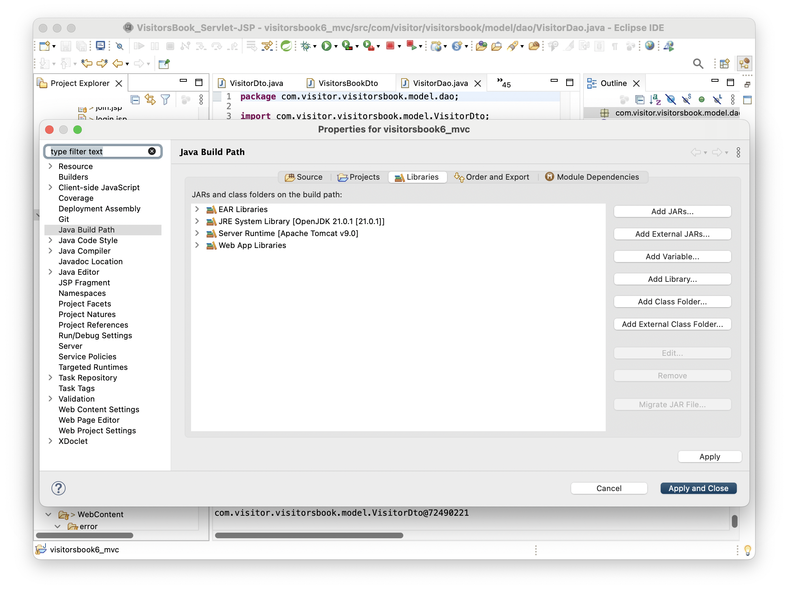
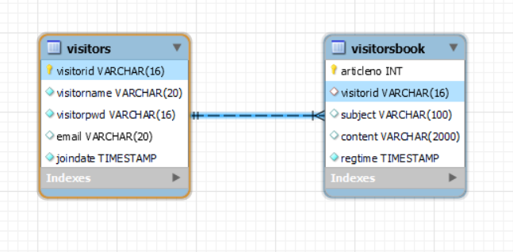
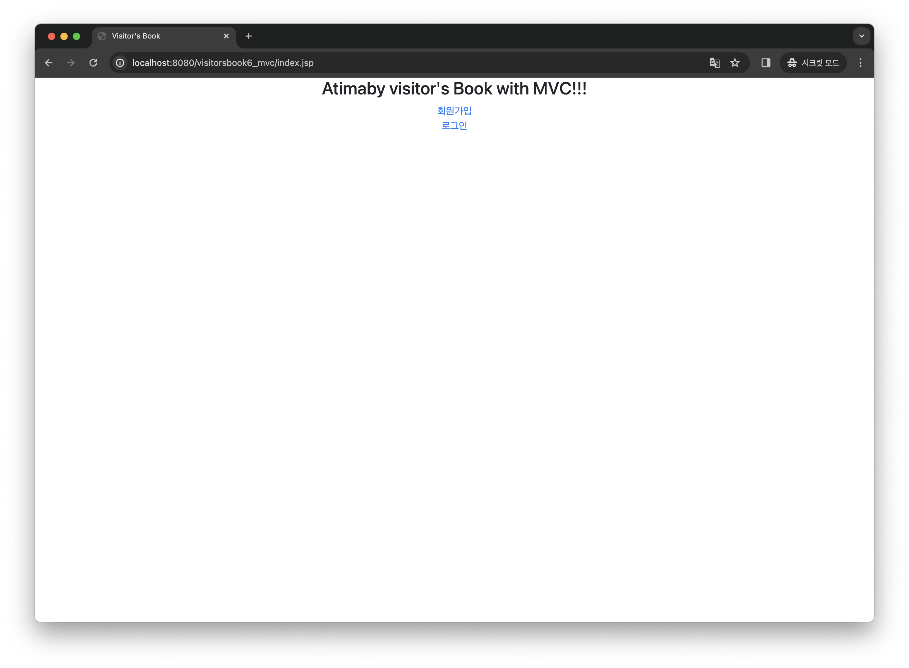
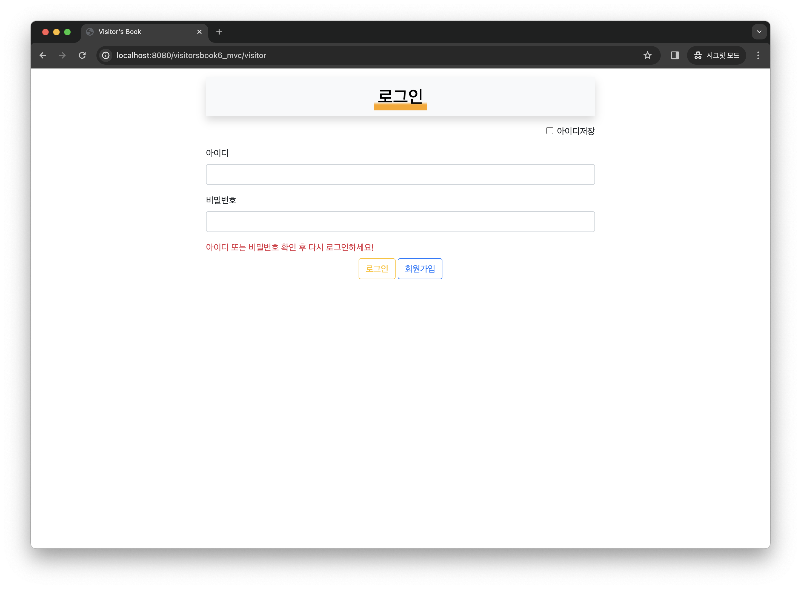
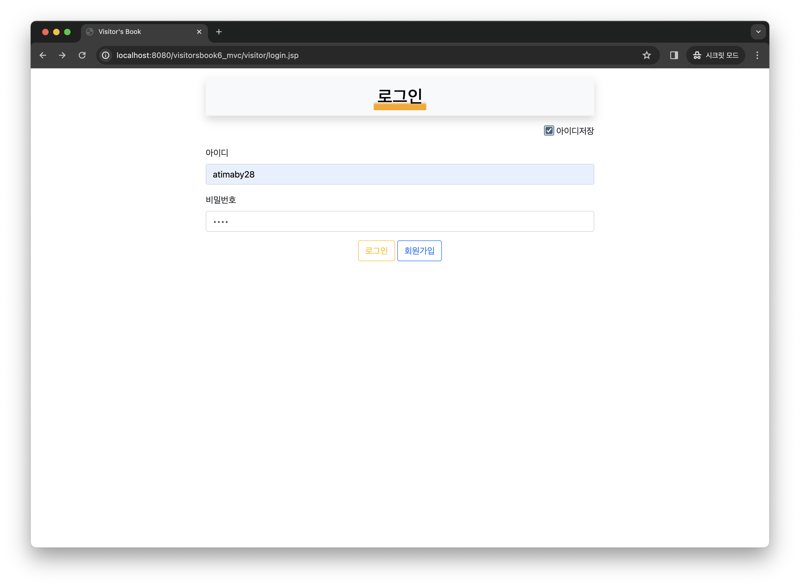
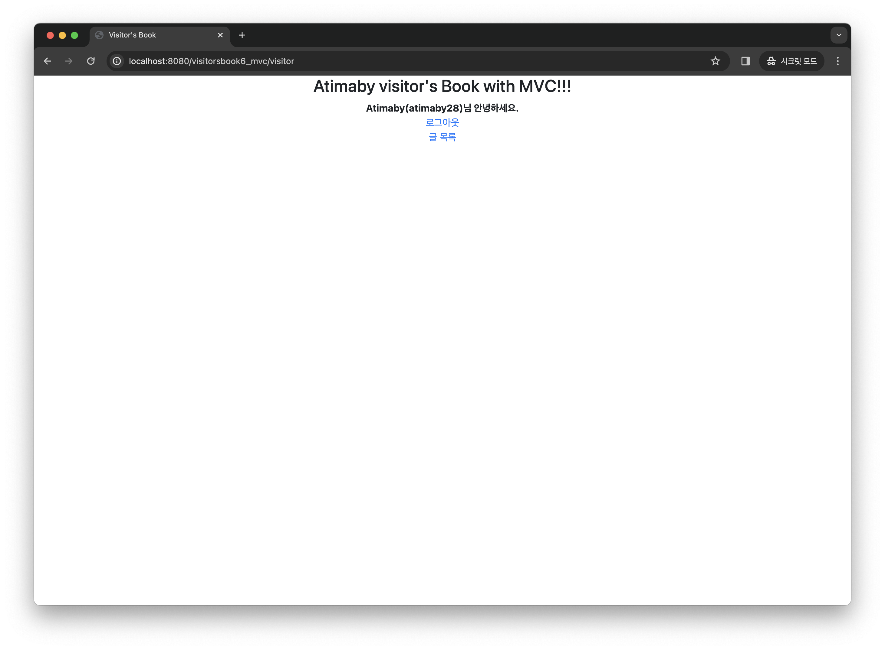
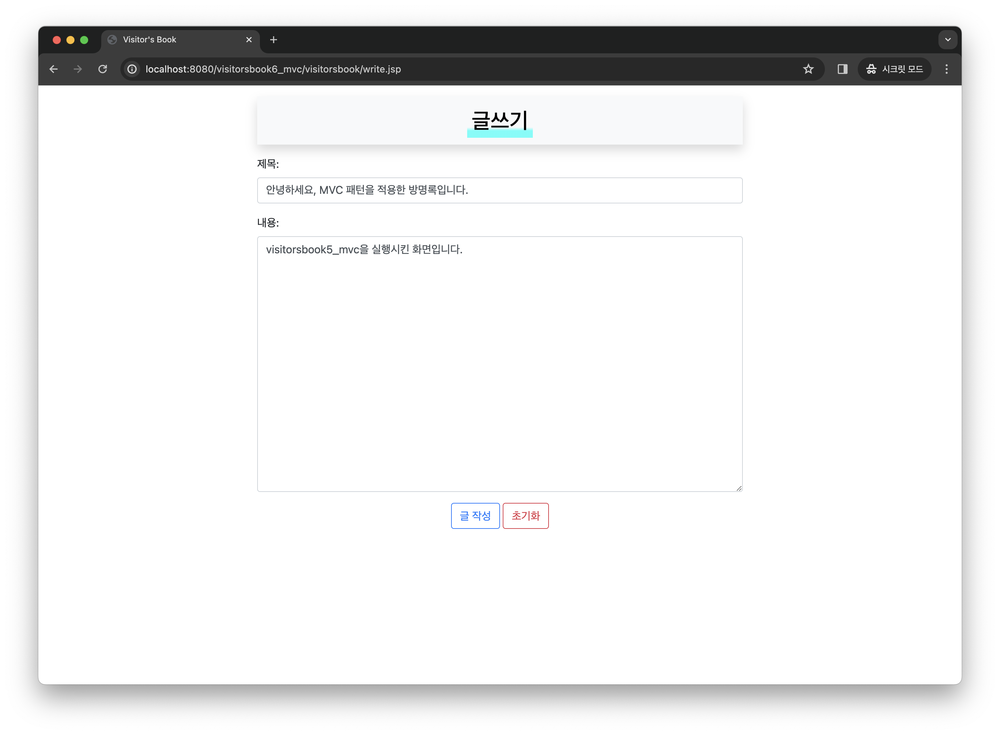
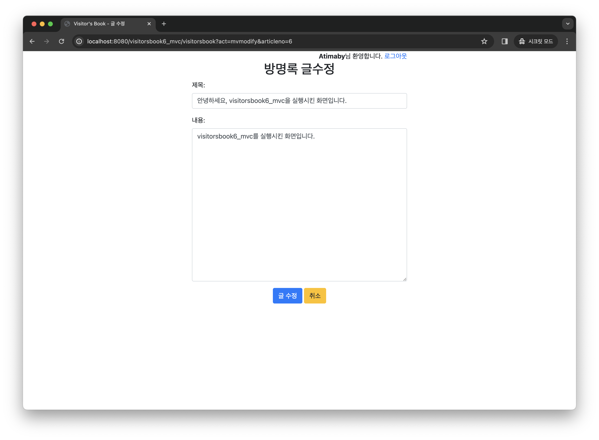
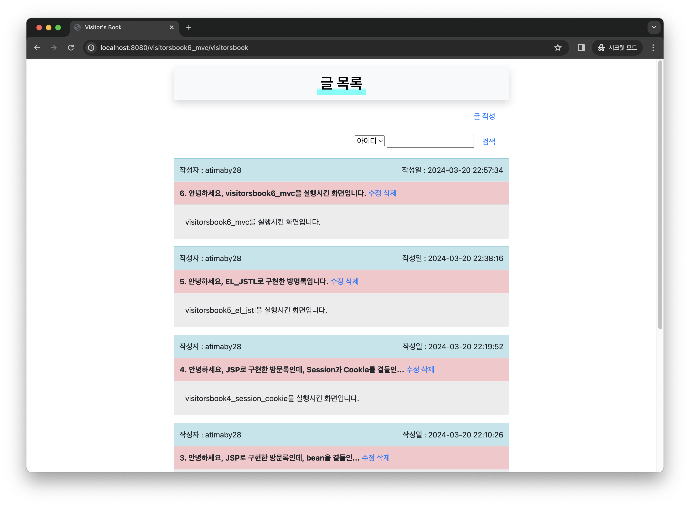

# VisitorsBook_Servlet-JSP

 

 ## 🐝 Servelt과 JSP를 이용한 방명록 만들기

  

 ### 프로젝트의 특징

 

스프링(Spring)을 공부하기 전 Servelt부터 시작하여 JSP, EL-JSTL 그리고 마지막으로 MVC Pattern까지 변화과정을 알아보며  
스프링의 탄생 배경을 이해합니다.
 

 

### 환경설정

  

 

위의 그림과 같이 프로젝트 Property를 열어 JRE System Library로 설치한 JDK를, Server Runtime으로 Tomcat 9.0을 설정해 줍니다.

 

### 프로젝트 소개

 

먼저 프로젝트에 사용되는 DB의 구조는 다음과 같습니다.

 

 
 

다음은 구현된 화면입니다.

 

 

단순한 첫 랜딩 페이지입니다.

 

 

로그인 화면이고, 아이디와 비밀번호가 틀렸을 시 동적으로 표현합니다.

 

 

Session과 Cookie를 사용하는 아이디 저장 기능이 있습니다.

 

 

로그인이 되면 방문자의 이름을 나타내며 회원가입과 로그인 버튼을 비활성화 시키고 글 목록을 활성화 시킵니다.

 

 

단순한 글쓰기 화면입니다.

 

 

단조로운 글 수정 화면입니다.

 

 

마지막 결과 화면이며 검색기능과 예외 페이지도 구현하였습니다.

---
